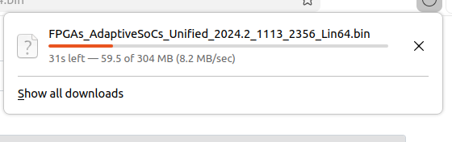
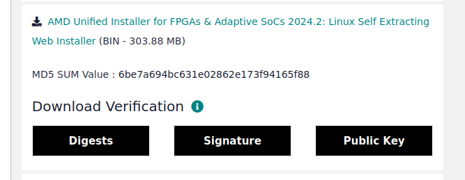
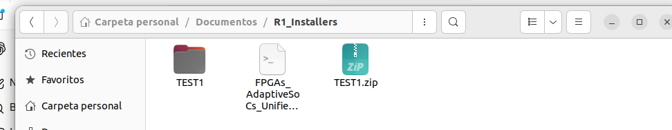

# 🛠️ Vivado 2025.2 Installation Guide on Ubuntu 22.04

> ⚠️ **Note:** Version **2025.2** was chosen because the lab PCs run **Ubuntu 22.04.5**. Version 2024.2 was not compatible with this Ubuntu release.

---

## 👥 Authors

| Role | Name | Program |
|------|------|---------|
| 📘 Author | Luis David Barahona Valdivieso | Electronic Engineering |
| 🤖 AI Assistant | Claude (Sonnet 4.6) — Anthropic | Large Language Model (LLM) |

---

## 📋 Table of Contents

1. [PC/Laptop Requirements](#1-pclaptop-requirements)
2. [Installation Steps](#2-installation-steps)
   - [2.1 Update system libraries](#21-update-system-libraries)
   - [2.2 Download the installer](#22-download-the-installer)
   - [2.3 Run the installer](#23-run-the-installer)
   - [2.4 Verify Vivado launches from terminal](#24-verify-vivado-launches-from-terminal)
   - [2.5 Create a desktop shortcut](#25-create-a-desktop-shortcut)
   - [2.6 Install JTAG drivers](#26-install-jtag-drivers)
3. [Functional Tests](#3-functional-tests)
   - [3.1 Tests with Basys 3](#31-tests-with-basys-3)
   - [3.2 Tests with PYNQ Z1](#32-tests-with-pynq-z1)
4. [Annexes](#4-annexes)
5. [Detected Errors](#5-detected-errors)

---

## 1. PC/Laptop Requirements

Make sure the following requirements are met before starting the installation:

- Operating system: **Ubuntu 22.04.5 LTS**
- Free disk space: at least **100 GB** (installation in `/tools/Xilinx` is recommended)
- Stable internet connection for downloading the installer
- Superuser privileges (`sudo`)

---

## 2. Installation Steps

### 2.1 Update system libraries

Update the system before installing to avoid dependency conflicts:

```bash
sudo apt update
sudo apt upgrade -y
sudo apt dist-upgrade -y
sudo dist-upgrade -y
```

---

### 2.2 Download the installer

Download the installer from the official AMD/Xilinx website:

🔗 [https://www.xilinx.com/support/download/index.html/content/xilinx/en/downloadNav/vivado-design-tools/2025-2.html](https://www.xilinx.com/support/download/index.html/content/xilinx/en/downloadNav/vivado-design-tools/2025-2.html)







---

### 2.3 Run the installer

Navigate to the directory where you downloaded the installer and run it. Follow the steps in the graphical wizard:

.png)

.png)

.png)

.png)

.png)

.png)

**Create the installation directory and assign permissions** before specifying the target path in the installer:

```bash
sudo mkdir -p /tools/Xilinx
sudo chown $USER:$USER /tools/Xilinx
```

.png)

.png)

.png)

.png)

---

### 2.4 Verify Vivado launches from terminal

#### Set environment variables

Add the Vivado settings script to your `.bashrc` file:

```bash
# If installed in /tools/Xilinx (RECOMMENDED)
echo 'source /tools/Xilinx/2025.2/Vivado/settings64.sh' >> ~/.bashrc
source ~/.bashrc
```

> ⚠️ **Note:** If you installed in `/opt/`, the command changes to:
> ```bash
> echo 'source /opt/Xilinx/2025.2/Vivado/settings64.sh' >> ~/.bashrc
> source ~/.bashrc
> ```


.png)

#### Test Vivado

```bash
vivado
```

.png)

#### For Vitis (optional)

```bash
echo 'source /tools/Xilinx/2025.2/Vitis/settings64.sh' >> ~/.bashrc
source ~/.bashrc
```

---

### 2.5 Create a desktop shortcut

Create a `.desktop` file to access Vivado from the Ubuntu application menu.

#### Option A — Path `/tools/Xilinx` (recommended)

```bash
nano ~/.local/share/applications/vivado.desktop
```

Paste the following content:

```ini
[Desktop Entry]
Version=1.0
Type=Application
Name=Vivado 2025.2
Comment=AMD Vivado FPGA Design Suite
Exec=/tools/Xilinx/2025.2/Vivado/bin/vivado
Icon=/tools/Xilinx/2025.2/Vivado/doc/images/vivado_logo.png
Terminal=false
Categories=Development;Engineering;
```

Save with `CTRL+O` → `ENTER` → `CTRL+X`, then run:

```bash
chmod +x ~/.local/share/applications/vivado.desktop
update-desktop-database ~/.local/share/applications
```

#### Option B — Path `/opt/Xilinx`

```bash
nano ~/.local/share/applications/vivado.desktop
```

```ini
[Desktop Entry]
Version=1.0
Type=Application
Name=Vivado 2025.2
Comment=AMD Vivado FPGA Design Suite
Exec=/opt/Xilinx/2025.2/Vivado/bin/vivado
Icon=/opt/Xilinx/2025.2/Vivado/doc/images/vivado_logo.png
Terminal=false
Categories=Development;Engineering;
```

```bash
chmod +x ~/.local/share/applications/vivado.desktop
update-desktop-database ~/.local/share/applications
```

Press the **Super/Windows** key, search for **Vivado**, and click to open it.

.png)

#### Desktop shortcut for Vitis (optional)

```bash
nano ~/.local/share/applications/vitis.desktop
```

```ini
[Desktop Entry]
Version=1.0
Type=Application
Name=Vitis 2025.2
Comment=AMD Vitis Design Suite
Exec=/tools/Xilinx/2025.2/Vitis/bin/vitis
Icon=/tools/Xilinx/2025.2/Vitis/doc/images/ide_icon.png
Terminal=false
Categories=Development;Engineering;
```

```bash
chmod +x ~/.local/share/applications/vitis.desktop
update-desktop-database ~/.local/share/applications
```


---

### 2.6 Install JTAG drivers

JTAG drivers are required to program FPGAs via USB cable.

```bash
cd /tools/Xilinx/2025.2/Vivado/data/xicom/cable_drivers/lin64/install_script/install_drivers
sudo ./install_drivers
```

.png)

#### Install additional libraries

```bash
cd /tools/Xilinx/2025.2/Vitis/scripts
sudo ./installLibs.sh
```

.png)

.png)

---

## 3. Functional Tests

### 3.1 Tests with Basys 3

#### Detect Basys 3

Connect the board via USB and verify that Vivado recognizes it in the Hardware Manager.

.png)

#### Load Bitstream

Open the Hardware Manager, connect to the target, and program the device with the bitstream.

.png)


---

### 3.2 Tests with PYNQ Z1

> 📷 *(Section pending completion )*

---


## 5. Detected Errors

### 5.1 PC L414-011 — Vivado installed in `/opt/Xilinx`

An error was detected on this PC related to the alternative installation path.

.png)

---

### 5.2 PC L414-012 — Incomplete installation

The file `settings64.sh` does not exist, indicating that the installation did not complete successfully.

> 💡 **Suggested fix:** Reinstall Vivado making sure the installation process finishes without interruptions and that the directory `/tools/Xilinx/2025.2/Vivado/` contains the `settings64.sh` file.

---

*Documentation generated with the assistance of Claude (Anthropic) — March 2026*
